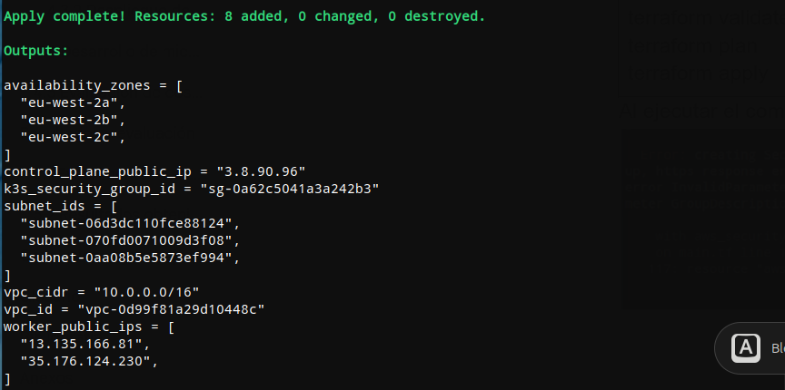

# cloud infrastructure: aws-k3s

Provisioning a distributed K3s cluster on AWS using Terraform (IaC).

## Objective
This repository is used to define and implement the infrastructure necessary to deploy a microservice:

- VPC
- Subnets across Availability Zones
- Security Groups
- 3 EC2 instances for a K3s cluster

## Tech stack

- AWS (EC2, VPC)
- Terraform (Infrastructure as Code)
- K3s (Lightweight Kubernetes)
- Git (Version control)

## Infrastructure as Code (IaC)

The infrastructure is defined using Terraform, enabling:

- Reproducibility of the environment
- Automated provisioning
- Version-controlled infrastructure
- Consistent deployments across environments

## Deployment

Terraform infrastructure successfully deployed on AWS.

## Status
Initial deployed on AWS using Terraform it was successfully. 

- VPC created with multiple subnets across Availability Zones
- Security groups configured with restricted SSH access
- EC2 instances provisioned for K3s cluster nodes

Infrastructure validated through real deployment.

K3s configuration in progress...

